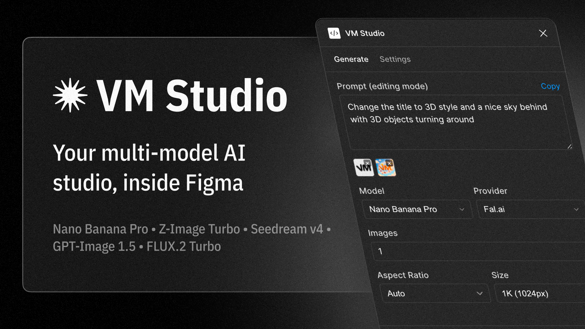

# VM Studio



AI image generation plugin for Figma with multiple models and providers.

## Features

- **5 AI Models**: Nano Banana Pro, Z-Image Turbo, Seedream v4.5, FLUX.2 Turbo, GPT-Image 1.5
- **4 Providers**: Fal.ai, Google AI Studio, OpenRouter, OpenAI
- **Text-to-Image & Image-to-Image**: Generate from prompts or transform existing images
- **Batch Generation**: Create multiple images at once with smart grid placement
- **Up to 4K Resolution**: 1K, 2K, or 4K output
- **10 Aspect Ratios**: Square, landscape, and portrait options

## Getting Started

1. Install from [Figma Community](https://www.figma.com/community/plugin/1588675833256652136)
2. Get an API key from your preferred provider
3. Open VM Studio → Settings → Enter your API key
4. Write a prompt and generate

## API Keys

- [Fal.ai](https://fal.ai/dashboard/keys)
- [Google AI Studio](https://aistudio.google.com/apikey)
- [OpenRouter](https://openrouter.ai/keys)
- [OpenAI](https://platform.openai.com/api-keys)

## Development

```bash
npm install
npm run watch
```

## License

MIT
